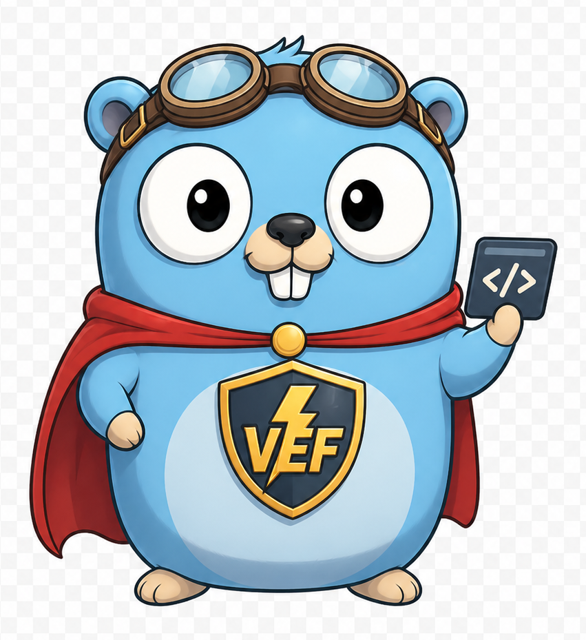

<h1 align="center">VEF Framework Go</h1>

<p align="center">
  
</p>

<p align="center">
  An opinionated Go framework for enterprise applications, built with Fiber, Uber FX, and Bun.
</p>

<p align="center">
  Unified API resources, generic CRUD, authentication, RBAC, validation, caching, events, storage, MCP, and more.
</p>

<p align="center">
  <a href="./README.md">English</a> |
  <a href="./README.zh-CN.md">简体中文</a> |
  <a href="#quick-start">Quick Start</a> |
  <a href="https://coldsmirk.github.io/vef-framework-go-docs">Documentation</a> |
  <a href="https://pkg.go.dev/github.com/coldsmirk/vef-framework-go">API Reference</a>
</p>

<p align="center">
  <a href="https://github.com/coldsmirk/vef-framework-go/releases"></a>
  <a href="https://github.com/coldsmirk/vef-framework-go/actions/workflows/test.yml"></a>
  <a href="https://codecov.io/gh/coldsmirk/vef-framework-go"></a>
  <a href="https://pkg.go.dev/github.com/coldsmirk/vef-framework-go"></a>
  <a href="https://goreportcard.com/report/github.com/coldsmirk/vef-framework-go"></a>
  <a href="https://deepwiki.com/coldsmirk/vef-framework-go"></a>
  <a href="https://github.com/coldsmirk/vef-framework-go/blob/main/LICENSE"></a>
</p>

VEF Framework Go combines dependency injection, HTTP routing, and data access into a cohesive application framework, with built-in support for API resources, authentication, RBAC, validation, caching, events, storage, MCP, and more.

> This README is intentionally brief. Detailed tutorials and reference material are available on the [documentation site](https://coldsmirk.github.io/vef-framework-go-docs).

> Development status: the project is still pre-1.0. Expect breaking changes while conventions and APIs continue to evolve.

## Why VEF

- One resource model for both RPC and REST APIs
- Generic CRUD primitives that reduce repetitive backend code
- Modular composition with Uber FX for clean wiring and extension
- Built-in auth, RBAC, rate limiting, audit, caching, events, storage, MCP, and other infrastructure you would otherwise assemble yourself

## Quick Start

Requirements:
- Go 1.26.0 or newer
- A supported database such as PostgreSQL, MySQL, or SQLite

Install:
```bash
go get github.com/coldsmirk/vef-framework-go
```

Create `main.go`:

```go
package main

import "github.com/coldsmirk/vef-framework-go"

func main() {
	vef.Run()
}
```

Create `configs/application.toml`:

```toml
[vef.app]
name = "my-app"
port = 8080

[vef.data_source]
type = "sqlite"
path = "./my-app.db"
```

This is the smallest runnable configuration. Sections such as `vef.monitor`, `vef.mcp`, and `vef.approval` are optional.

Run:

```bash
go run main.go
```

VEF loads `application.toml` from `./configs`, `.`, `../configs`, or the path pointed to by `VEF_CONFIG_PATH`.

## Core Concepts

- `vef.Run(...)` starts the framework and wires the default module chain: config, database, ORM, middleware, API, security, event, CQRS, cron, redis, mold, storage, sequence, schema, monitor, MCP, and app.
- API endpoints are defined as resources with `api.NewRPCResource(...)` or `api.NewRESTResource(...)`.
- Business modules are composed with FX options, for example `vef.ProvideAPIResource(...)`, `vef.ProvideMiddleware(...)`, and `vef.ProvideMCPTools(...)`.
- CRUD-heavy modules can build on the generic helpers in `crud/` instead of writing repetitive handlers from scratch.

Typical application layout:

```text
my-app/
├── cmd/
├── configs/
└── internal/
    ├── auth/
    ├── sys/
    ├── <domain>/
    └── web/
```

## Documentation

- Documentation site: <https://coldsmirk.github.io/vef-framework-go-docs>
- API reference: <https://pkg.go.dev/github.com/coldsmirk/vef-framework-go>
- Repository knowledge map: <https://deepwiki.com/coldsmirk/vef-framework-go>
- Testing conventions: [TESTING.md](./TESTING.md)

If you need step-by-step guides, architectural deep dives, or feature-specific reference, prefer the [documentation site](https://coldsmirk.github.io/vef-framework-go-docs) rather than expanding this README.

## Development

Common verification commands:

```bash
go test ./...
go test -race ./...
golangci-lint run
go run golang.org/x/tools/gopls/internal/analysis/modernize/cmd/modernize@latest -test ./...
```

## License

Licensed under the [Apache License 2.0](./LICENSE).
